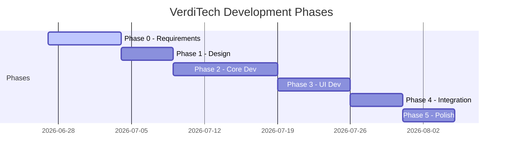

# VerdiTech — Milestones & Timeline
> Project: VerdiTech | Last Updated: June 30, 2026

Project phases, milestones, and delivery timeline. Dates are TBD until the client confirms the project deadline.

---

## Project Phases Overview

*Note: Durations above are estimates. Actual dates will be set after client confirms deadline.*

---

## Phase Details

### Phase 0: Requirements Gathering

| Attribute | Details |
|-----------|---------|
| **Status** | ✅ Complete |
| **Started** | June 27, 2026 |
| **Target End** | June 27, 2026 |
| **Objective** | Gather all information needed to begin design and development |

**Deliverables:**
- [x] Receive and analyze client specification
- [x] Complete technical analysis
- [x] Prepare and send client questionnaire
- [x] Create project memory system (13 files)
- [x] Receive client detailed spec confirmation
- [x] Finalize core scope and feature list
- [ ] Confirm project deadline and timeline
- [x] Get client sign-off on scope document

**Exit Criteria:** Core scope confirmed; ready for design.

---

### Phase 1: Design

| Attribute | Details |
|-----------|---------|
| **Status** | ✅ Complete |
| **Started** | June 27, 2026 |
| **Target End** | June 27, 2026 |
| **Objective** | Design the app architecture, data models, UI, and CA rules before coding |

**Deliverables:**
- [x] UI/UX wireframes or mockups (key screens)
- [x] Finalize data models (Plant, GrowthStage, EnvironmentalFactors, Prediction)
- [x] Specify CA transition rules with exact parameters
- [x] Define app architecture and folder structure
- [x] Select and lock tech stack (state management, database, packages)
- [x] Create navigation flow diagram

**Key Screens to Design:**
1. Home / Landing screen
2. Plant Input Form
3. Prediction Results / Growth Timeline
4. Plant Health Status & Recommendations
5. Dashboard (if F006 confirmed)
6. CA Visualization (if F007 confirmed)
7. About / How It Works (if F010 confirmed)

**Exit Criteria:** All designs reviewed; data models defined; CA rules specified; tech stack locked.

---

### Phase 2: Core Development

| Attribute | Details |
|-----------|---------|
| **Status** | ✅ Complete |
| **Started** | June 27, 2026 |
| **Target End** | — |
| **Objective** | Build the prediction engine, data layer, and foundational code |

**Deliverables:**
- [x] Flutter project initialized with folder structure
- [x] Plant data models implemented
- [x] CA prediction engine implemented and unit-tested
- [x] Environmental scoring system implemented
- [x] Seasonal modifier logic implemented
- [x] Recommendation engine implemented
- [x] Local data persistence set up (if F008 confirmed)
- [x] Unit tests for CA engine (minimum 80% coverage on core logic)

**Priority Order:**
1. 🔴 CA Engine (F002) — this is the heart of the app
2. 🔴 Plant Data Models — structures for all three plants
3. 🔴 Environmental Scoring — factor weights and score calculation
4. 🔴 Recommendation Logic (F004) — tip generation
5. 🟡 Data Persistence (F008) — if confirmed

**Exit Criteria:** CA engine produces reasonable predictions for all 3 plants; unit tests pass.

---

### Phase 3: UI Development

| Attribute | Details |
|-----------|---------|
| **Status** | ✅ Complete |
| **Started** | — |
| **Target End** | — |
| **Objective** | Build all user-facing screens and navigation |

**Deliverables:**
- [x] Plant Input Form screen (F001)
- [x] Prediction Results screen with Growth Timeline (F005)
- [x] Health Status & Recommendations screen (F003 + F004)
- [x] Dashboard screen (F006 — if confirmed)
- [x] CA Visualization screen (F007 — if confirmed)
- [x] About / How It Works screen (F010 — if confirmed)
- [x] App navigation and routing
- [x] Theme and styling (colors, fonts, icons)
- [x] Responsive layout testing

**Exit Criteria:** All confirmed screens built; navigation works; visual styling complete.

---

### Phase 4: Integration & Testing

| Attribute | Details |
|-----------|---------|
| **Status** | ✅ Complete |
| **Started** | — |
| **Target End** | — |
| **Objective** | Connect the prediction engine to the UI; comprehensive testing |

**Deliverables:**
- [x] Wire UI inputs to CA engine
- [x] Display predictions in the timeline visualization
- [x] Display health status and recommendations from engine output
- [x] End-to-end testing of all user flows
- [x] Edge case testing (all Low inputs, all High inputs, boundary conditions)
- [x] Push notification integration (F009 — deferred)
- [x] Performance testing on target device
- [x] Fix all Critical and High bugs

**Test Scenarios:**
| Scenario | Expected Behavior |
|----------|-------------------|
| Tomato, all Excellent, Malamig | Fastest growth timeline (~70 days) |
| Eggplant, all Very Low, Tag-init | Very slow / stalled growth; critical warnings |
| Siling Labuyo, moderate inputs, Tag-ulan | Moderate timeline with wet season adjustments |
| Change factor mid-flow | Prediction updates immediately |
| App restart (if persistence) | Saved data loads correctly |

**Exit Criteria:** All user flows work end-to-end; no Critical bugs; predictions are reasonable.

---

### Phase 5: Polish & Delivery ⬅️ CURRENT PHASE

| Attribute | Details |
|-----------|---------|
| **Status** | 🟡 In Progress |
| **Started** | — |
| **Target End** | — |
| **Objective** | Final polish, documentation, and delivery of thesis-ready app |

**Deliverables:**
- [ ] Fix remaining Medium/Low bugs
- [ ] Performance optimization
- [ ] Final UI polish (animations, transitions, error states)
- [ ] Build release APK
- [ ] Test release APK on physical device
- [ ] Prepare user guide / documentation (if needed for thesis)
- [ ] Prepare demo script for thesis defense (if requested)
- [ ] Final code cleanup and documentation
- [ ] Deliver APK and source code to client

**Exit Criteria:** Release APK works; client has all deliverables; app is demo-ready.

---

## Milestone Summary

| Milestone | Phase | Target Date | Status |
|-----------|-------|-------------|--------|
| M1: Requirements complete | Phase 0 → 1 | 2026-06-27 | ✅ Complete |
| M2: Design approved | Phase 1 → 2 | 2026-06-27 | ✅ Complete |
| M3: CA engine working | Phase 2 midpoint | 2026-06-28 | ✅ Complete |
| M4: Core dev complete | Phase 2 → 3 | 2026-06-28 | ✅ Complete |
| M5: All screens built | Phase 3 → 4 | 2026-06-28 | ✅ Complete |
| M6: Integration complete | Phase 4 → 5 | 2026-06-28 | ✅ Complete |
| M7: Documentation audit passed | Phase 5 | 2026-06-30 | ✅ Complete |
| M8: Release APK delivered | Phase 5 end | TBD | ⬜ Not Started |

---

## Notes

- Timeline will be populated once the client confirms the project deadline.
- If timeline is tight (< 3 weeks), Phases 1–2 may overlap and Phase 5 may be compressed.
- If timeline is very tight (< 2 weeks), consider reducing scope to Core features only (F001–F005).
- Always maintain a buildable, demo-able version from Phase 2 onward.
